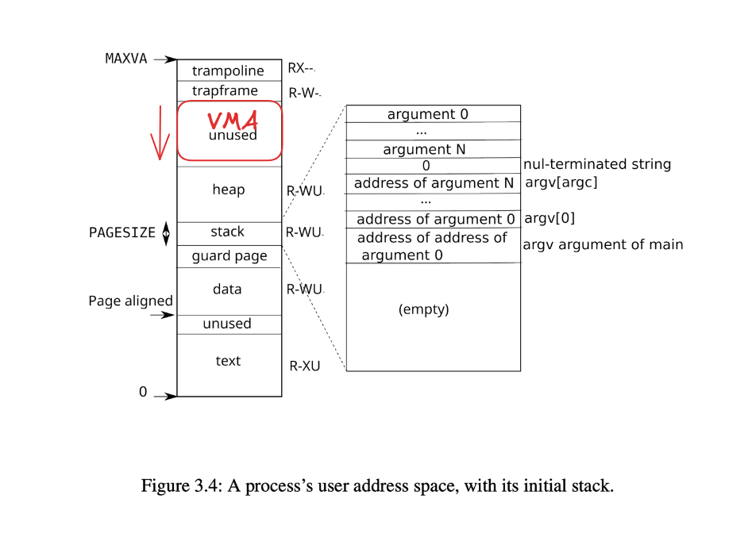

# Lab: mmap

## Details

See https://pdos.csail.mit.edu/6.1810/2025/labs/mmap.html

## DEMO

Watch https://docs.google.com/videos/d/1fflAZVqdzp_ywhbnwGPn48KkLF5tuL2kPy2PPBwIbHk/play

## Related source code

Here https://github.com/timyiu478/mit-operating-system-engineering-2025/commit/7e307106d9643692527ec1d3cd44f36f25a71986

## Design Choices

### VMA Memory Region in Address Space



The VMA region grows downwards, starting just below the trapframe page.
To manage this, we added a field mmap_base in struct proc to track the current highest available address for new mmap regions.
The mmap_base only moves downward when a new mapping is created. It moves upward only when the process unmaps a region whose starting address exactly matches the current mmap_base.

Reasons for this design:

* The heap grows upward while the mmap region grows downward, naturally separating the two areas.
* A simple overlap check can be added in growproc() and sys_mmap() (e.g., reject if p->sz + n >= p->mmap_base).
* The trapframe and trampoline pages are protected from being overwritten.
* Page fault handling becomes straightforward: if va < p->sz, it belongs to the heap; otherwise, we search the VMA list.
* No guard pages or reserved regions are needed, avoiding virtual address space waste when few or no mappings are active.

## Assumptions

1. The addr arugment in mmap() will always be zero, meaning that the kernel should decide the virtual address at which to map the file.
1. An munmap call might cover only a portion of an mmap-ed region, but you can assume that it will either unmap at the start, or at the end, or the whole region (but not punch a hole in the middle of a region).

This means the test cases never do something like:

* mmap 0x8000–0xC000 (16KB)
* munmap(0x9000, 0x2000) <= middle hole (forbidden in the lab)

## Mistakes I made

### No zero the page

> For a file that is not a multiple of the page size, the remaining bytes in the partial page at the end of the mapping are zeroed when mapped, and modifications to that region are not written out to the file. Ref: https://man7.org/linux/man-pages/man2/mmap.2.html#NOTES

When mapping a file whose size is not a multiple of the page size, the remainder of the last page must be zero-filled. Modifications to this zero-filled portion should not be written back to the file.

```c
495     // Zero the rest of the page if short read
496     if (n < PGSIZE) {
497       memset((void*)(mem + n), 0, PGSIZE - n);
498     }
```

Without this, the test fails with:

```console
$ mmaptest
test basic mmap
mismatch at 6144, wanted zero, got 0x5
mmaptest failure: v1 mismatch (2), pid=3
```

### Incorrect permission checking for mmap

The protection flags of a mapping must respect the open file’s permissions. Specifically, it is illegal to create a MAP_SHARED mapping with PROT_WRITE if the file is not writable.

Correct check:

```c
if (((prot & PROT_WRITE) > 0) & !p->ofile[fd]->writable & (flags & MAP_SHARED)) {
     return -1;
}
```

Note: Mapping with PROT_WRITE and MAP_PRIVATE is allowed, since changes stay private and are not written back.

Additionally, writing to a read-only mapping (PROT_READ only) is a fatal fault. The kernel must kill the process:


```c
474     if (!read && !(p->vma[i].prot & PROT_WRITE)) {
475       // printf("vmfault: unable to write to a read-only memory mapped file\n");
476       p->killed = 1; // fatal fault
477       return -1;
478     }
```

### Write back more data than file size

> System will never write any modification of the object beyond its end. Ref: https://man7.org/linux/man-pages/man2/mmap.2.html

According to the mmap specification, the system must never write beyond the end of the file. Even if the mapped region is larger than the file, only data up to the current file size may be written back during munmap().

I made this mistake where I simply wrote back the entire mapped memory area to the file.

### Write back a page that is not lasy allocated

The deadlock will be triggered when we write back a page that is not lasy allocated.
Because in our write back code, we needs to hold a lock of the inode before calling writei(), and
then copyin() triggers a page fault, which calls vmfault(), which does ilock() again.

To fix this problem, we should only write back the page that is valid (and dirty).

I found I made this mistake by noticing all processes are SLEEPING and debugging with GDB:

```console
(gdb) b sleeplock.c:26
Breakpoint 1 at 0x80003766: file kernel/sleeplock.c, line 26.
(gdb) c
Continuing.

Thread 1 hit Breakpoint 1, acquiresleep (lk=lk@entry=0x800221b0 <itable+312>) at kernel/sleeplock.c:26
26	    sleep(lk, &lk->lk);
(gdb) bt
#0  acquiresleep (lk=lk@entry=0x800221b0 <itable+312>) at kernel/sleeplock.c:26
#1  0x0000000080002ac4 in ilock (ip=0x800221a0 <itable+296>) at kernel/fs.c:302
#2  0x0000000080000aca in vmfault (pagetable=pagetable@entry=0x87f25000, va=va@entry=274877865984, read=read@entry=0) at kernel/vm.c:484
#3  0x0000000080000d04 in copyin (pagetable=0x87f25000, dst=dst@entry=0x8001f998 <bcache+24576> 'A' <repeats 200 times>...,
    srcva=srcva@entry=274877865984, len=len@entry=1024) at kernel/vm.c:392
#4  0x000000008000188e in either_copyin (dst=dst@entry=0x8001f998 <bcache+24576>, user_src=user_src@entry=1, src=src@entry=274877865984,
    len=len@entry=1024) at kernel/proc.c:657
#5  0x0000000080002f92 in writei (ip=0x800221a0 <itable+296>, user_src=user_src@entry=1, src=274877865984, src@entry=274877861888,
    off=4096, off@entry=0, n=n@entry=6144) at kernel/fs.c:545
#6  0x0000000080002298 in sys_munmap () at kernel/sysproc.c:238
#7  0x0000000080001e66 in syscall () at kernel/syscall.c:145
#8  0x0000000080001bf0 in usertrap () at kernel/trap.c:68
#9  0x0000003ffffff09c in ?? ()
```

## Key Takeaways

* How to manage per-process virtual memory regions using VMAs.
* Deeper understand of the benefits of mmap and the API of mmap
    * After the data is copied from buffer cache to VMA address mapped region, the user process can read/write the data without using system calls 
        * => no mode switch, no memory copy from kernel space to user space, no disk I/O
    * Lasy allocation: the page is copied from buffer cache to VMA address mapped region only when the user try to access such page
    * Multiple processes can share the same page of physical memory

