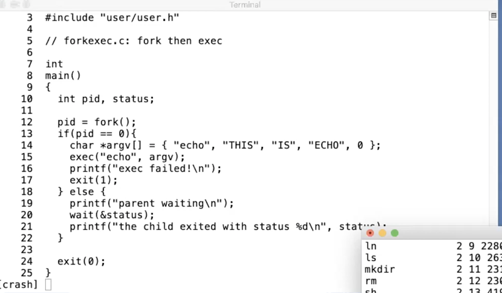

Why does the kernel copy the parent's file descriptor table to the child?

```
fd = open()
pid = fork()
```

Shell: 

* share STDIN, STDOUT, STDERR
* able to implement shell pipelines & I/O redirection
    * Note: `pipe()` creates/allocates entries (two of them) in the file descriptor table 
    * Example program: [examples/pipe_fd.c](examples/pipe_fd.c)

---

What If the program does two fork() calls (creating two child processes) but the parent only calls wait(&status) once?



The single wait() call will block until the first of the two children terminates.

The wait() will return the pid of the first-exited children.

The status will contain the exit value of the first-exited children.

```
wait() and waitpid()
  The wait() system call suspends execution of the calling thread
  until one of its children terminates.

// ref: https://man7.org/linux/man-pages/man2/waitpid.2.html
```
