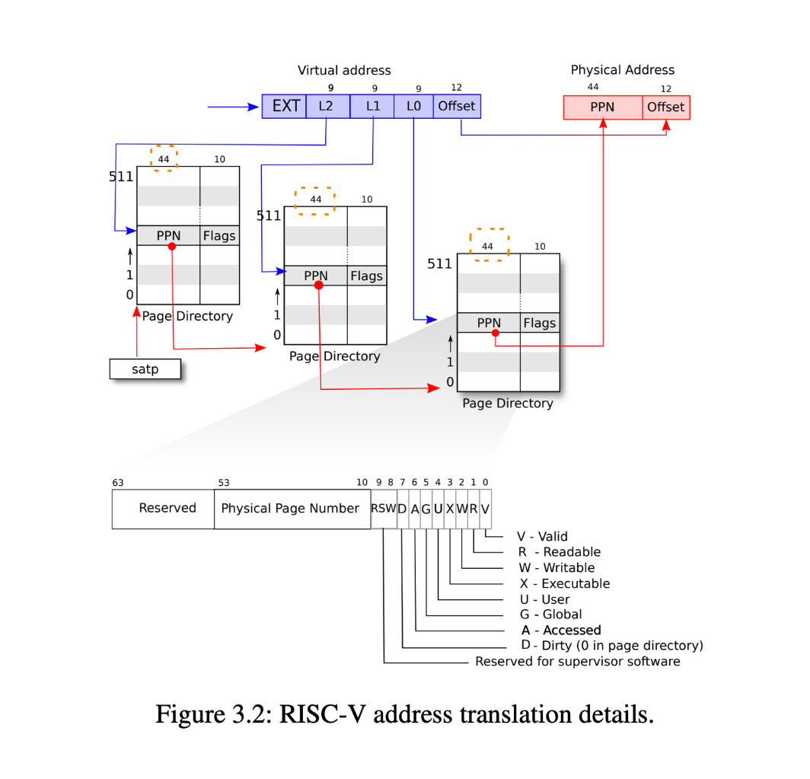

virtual address size can larger than physical address size

---

Q. How to use 44 bit PPN to find the 64 bit address of page directory?

The bottom 12 bits of every page directory's physical address are always zero.

That means each page directory is page aligned (each page is 12 bits).

Q. Why page directory store phyiscal address (PNN)? why not use virtual address?

To use virtual address, we need a virtual to physical translation mechanism.
If the page directory store virtual address of the next level page directory,
it needs to depend on a yet another translation mechanism to look up the next level page directory.

---

TLB:

Q. Why we need to know about translation look-aside buffer?

When the OS update the page table, the TLB needs to be flushed.

Q. Where does the TLB sit? Before or after MMU?

TLB is sit before MMU => 

* indexed by virtual address

---

Q. Why kernel needs to implement the functions relate to address translation e.g. walk the page directories?

* create page table entry
* copy memory from kernel to user process (and vice-versa)
