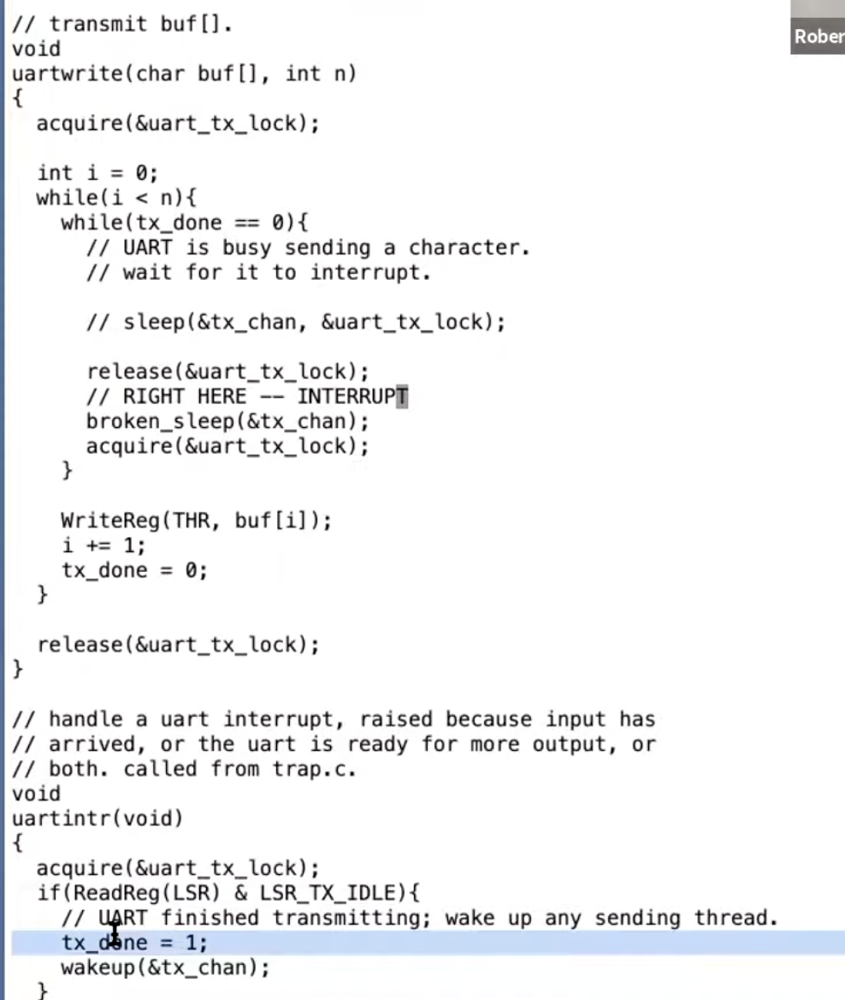

Coordination primitives:

* sleep, wake up
* **kill, exit, wait**
        

Why sleep/wake up?

* need to wait certian events: read from pipe, disk read, parent process waits for childen process exit

Lost wake up:

* the intterrupt can happen immediately after `release(&uart_tx_lock)` and immediately before `broken_sleep(&tx_chan)` because release the lock re-enable the intterrupt.
* so it is possible that `uartintr()` runs completely before `broken_sleep(&tx_chan)` such that no one will wake up process who called `uartwrite()`.

Why do we always wrap the sleep() inside a while loop?

* wakeup() in xv6 wakes all processes sleeping on the same channel (broadcast behavior).
* In the UART driver, many processes can be waiting to transmit => when one character finishes, all are woken.
* Only one acquires the lock and makes progress (writes one byte, clears tx_done or advances the buffer).
* The others, when they later acquire the lock, see the condition is false again => they must sleep again.
* Without the loop, those processes would incorrectly proceed and cause data corruption or lost characters.

Exit and wait:

* When a process exits, it does not free all its resources.
* It requires its parent to call `wait` function to free all its resources.

