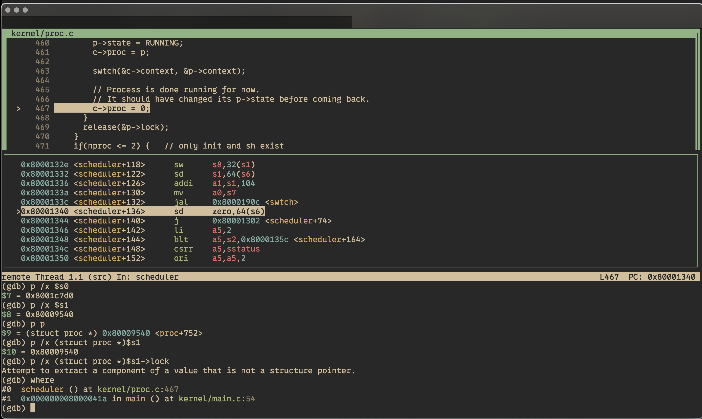

# Question

For this lecture, read the following files in the xv6 kernel implementation:

* kernel/proc.c, focusing on yield, sched, and scheduler
* kernel/swtch.S

yield() calls acquire(&p->lock) to lock the current process p. Which line of code releases that lock? Hint: it's not the call to release(&p->lock) in yield().

You may find chapter 8 of the book useful in understanding how the kernel implements thread switching.

# Answer

The [proc.c:456](https://github.com/mit-pdos/xv6-riscv/blob/riscv/kernel/proc.c#L456) is the line of code releases that lock.

Verified using GDB:

