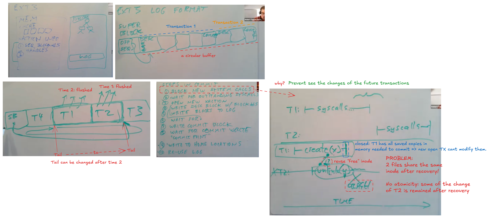

# Takeaways

* The performance advantages of ext3fs(ext2fs + journaling)
    * e.g. many transactions can run in parrallel in different stages => I/O concurreny
* Some implementation details of ext3fs
    * e.g. log disk layout, how to distinguish descriptor/commit block and data block?

# Motivations

* recovery takes a lot of time (hour)

# Important Rules about logging system

* Write ahead rule: all updates must be written into the log area first.
* Freeing rule: Log can be reused only until all the data in the log are written back to the home location.

# Overall Design

---

# Details

## File system Reliability

* Reliability: can recovery the contents of a crashed file system
    * Aspects of it:
        * Predictability: the failure modes from which we have to recover should be predictable
        * Atomicity

## Ways to achieve atomicity

* Log-structure FS
* Journalling
* Log-structure FS vs Journalling: 
    * Log-structure FS: treats entire disk as log
    * Journalling: seperate log area and data area(or home location) 

## Transaction in Database vs Filesytem

Filesystem:

* No transaction abort: before start making changes in FS, we have already make sure the changes can be fully completed/recovered. commit the transaction with no change = abort transaction.
* Short-live transaction: affect how we handle transaction dependency => can require transaction commit in strict sequential order without significantly hurting performance => a system-wide compund transaction.
    * pros: batch metadata(bitmap, inode) updates into single write => higher throughput
    * decision: when to commit?

---

# Questions

Q. Mid-way down the left column on page 6, the Journaling paper says "However, until we have finished syncing those buffers, we cannot delete the copy of the data in the journal". What is a concrete example in which removing this rule would lead to disaster?

For instance: imagine creating a new file. This requires updating:

1. the free block bitmap,
2. the inode for the new file,
3. and the directory entry.

If the system deletes the journal copy before syncing all three, and a crash occurs after only the bitmap is updated, recovery won’t know what the intended operation was. The bitmap says the block is allocated, but the inode and directory entry aren’t updated — a classic inconsistency.

Q. Why logging/journaling?

Logging for atomicity: updates do not take effect before commit.

Q. An example of transaction ordering matter

Why transaction ordering matter? Update based on what it read

T1. delete filename into directory
T2. insert filename into directory

If T2 before T1, error: duplicate directory entry.

Q. xv6 logging vs this paper's journalling

xv6: 

* file write syscall is synchronous.
* no new transaction while transaction is committing

paper:

* each transaction has its own sequence number.
* circular log
* file write syscall is asynchronous: syscall returns before disk write
    * pros: 
        * I/O concurrency (CPU can do things while disk is writing)
        * more batching (because process can call more than 1 file write syscalls)
        * parallel syscalls
    * cons: syscall return != file is written in the disk => user process needs to call fsync(fd).
* Batching: one "OPEN" transaction per 5 seconds
    * pros: write absorbtion, disk scheduling (e.g. sort writes in ascending order based on track/slot # -> reduce disk seek time)
* Concurrency:
    * many transactions can run in parrallel in different stages => I/O concurreny
        * one OPEN (write to memory)
        * one committing to the log (from memory)
        * one writing to the home location (from log)
        * freeing the transaction
    
Q. How to prevent the open transaction and the transaction that is commiting to the log shares the same piece of memory(buffer cache)?

The transaction that is commiting to the log has its own saved copy of cache.

Q. How can the recovery code know whether the transaction is committed?

The descriptor is the first block that written into the disk.
The descriptor block contains how many of data block contains in this transaction.
The recovery code can use this information to find the corresponding commit block.
If the recovery cant find the commit block, then the transaction is not commited.

How to distinguish descriptor/commit block and data block?

* magic word
* if a data block contains a magic word, it will replace those bytes to 0 and write it to the log. When recovery happens, it will load this block into memory and change those bytes to magic word before replaying the block to disk.

Noted that: the tail of the log only can be advanced if the old transaction that starts from the tail is fully flushed to the disk.

---

# Why I read this paper

Xv6 logging system is slow.

* requires 2x of disk writes for crash recovery.
* synchronous call: process can't return from kernel mode after the FS is finished the file operation.

I want to know a faster journaling design.

The ext3 is a widely used file system.

# Further Study

LFS: https://pages.cs.wisc.edu/~remzi/OSTEP/file-lfs.pdf
