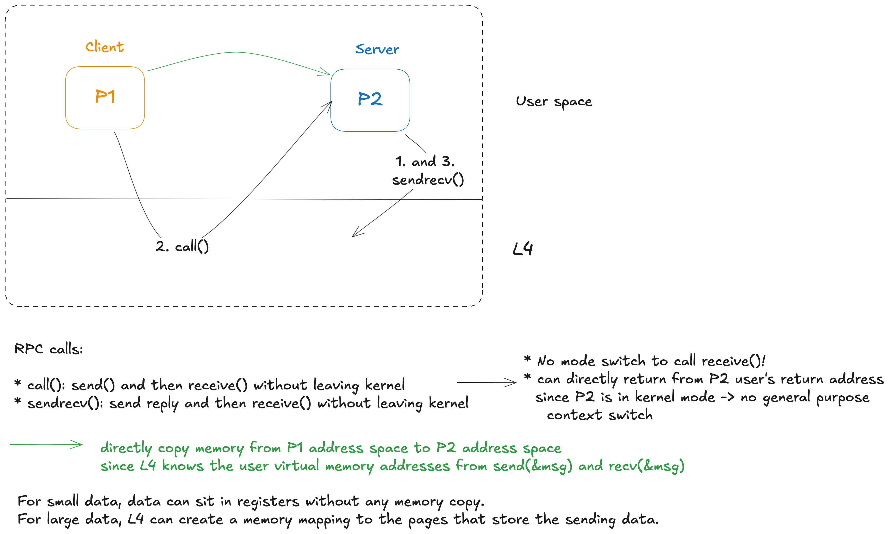
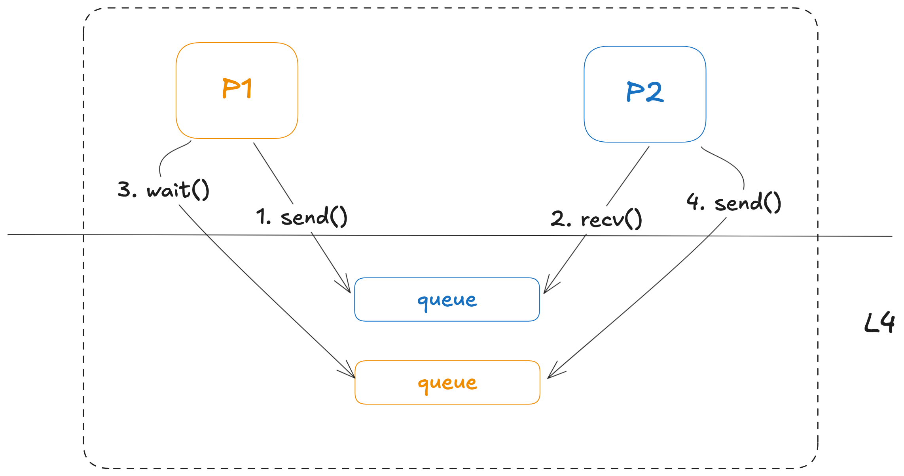

# Takeaways

* L4 fast IPC design

# Motivations

To determine whether L4, a lean second-generation µ-kernel, has overcome the limitations of the first generation of micro-kernek which is slow and lack of flexibility.

# Results

The comparison of L4Linux and monolithic Linux shows that in a practical scenario, the penalty for using µ-kernels can be kept somewhere between 5% and 10% for applications.

# L4 Overal Design

Kernel Primitives:

Fast IPC:

---

# Details

---

# Questions

Q. What is one feature/subsystem that's implemented in the kernel in xv6, but is implemented in userspace (i.e., missing from the kernel) in L4? What Unix operations are particularly slow on an L4-based Linux system, and why?

Q. What is micro-kernel?

A kernel that only provides small set of primitives such as address space, thread and IPC.
File system, network stack, and VM can be a user process.
If a process wants a file, it can use IPC talks to file system to get a file.

Q. Why monolithic kernel?

* no rigid splits of kernel sub-systems such as file system and virtual memory
  => easier to implement and optimize exec()
* high abstraction (e.g. file descriptor) => make application programmer life easy

Q. Why micro-kernel/Why not monlithic?

Monlithic:

* many code -> higher complexity -> more (secure) bugs
* general purpose -> slow
    * think about how to move one byte from one process to another process (sleep, wakeup, locking, ...)
* design decisions are baked in kernel. E.g.
    * API of wait(): can't wait for grandchild

L4:

* 7 syscalls: thread create, IPC, mapping, interrupt -> IPC, ...
* 13,000 LOC

Q. What are the challenges of micro-kernel?

* the minimum API of the micro-kernel that is simple and powerful
* fast IPC

Q. How to make micro-kernel usable?

One way is to run adapted Linux as a single server on top of L4 that Linux's address space is 1-to-1 map to the kernel's address space.

Q. What are the things handled by IPC?

* page fault -> IPC to pagers
* hardware interrupt -> IPC to device drivers

Q. why is IPC slow?

One IPC design: **asynchronous buffered**

* 4 syscalls
* context switches: p1 -> p2, p2 <- p1

---

# Why I read this paper

I want to study alternative OS designs, specifically microkernels, as a departure from the **monolithic** model.

