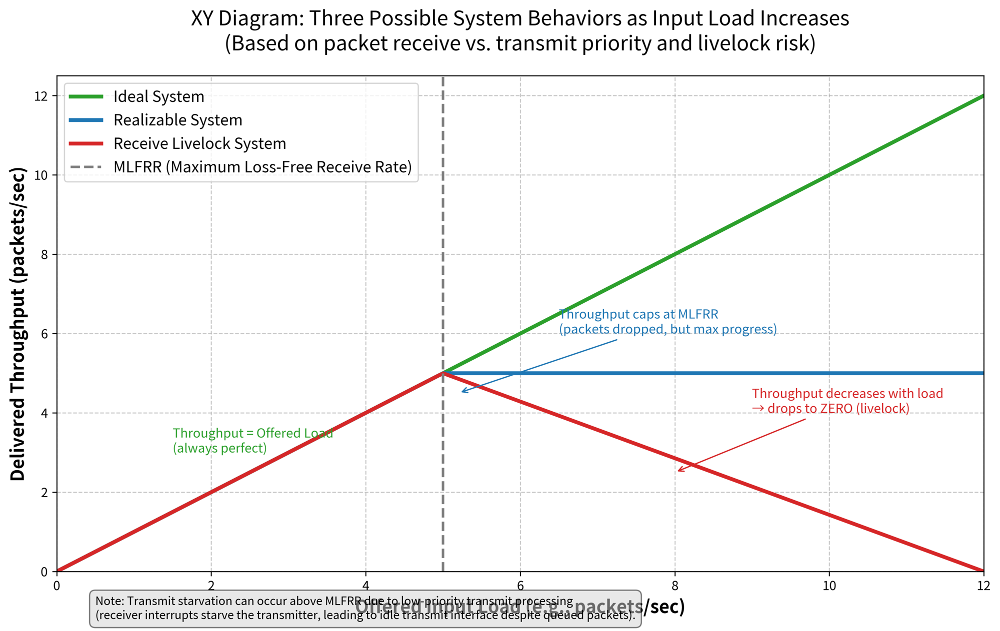

# Takeaways

* Why does receive livelock can occur in an interrupt-driven kernel when input load is high: receive intterupt task has the highest priority
* How to avoid livelock:

# Motivations

Receive Livelock: the kernel spends all its time of processing interrupt instead of doing useful work (e.g. processing packet).

Network File System:

* applications use datagram protocol => no flow control => no negative feedback loop to control the source (e.g. reduce sending rate)

# Result

The modified interrupt-driven implementation elimate receive livelock without degrading other aspects of system performance.

---

# Details

## 4.2BSD Model

* Higher IPL(Interrupt Priority Level) tasks (e.g. hardware interrupt handler) preempt all lower IPL tasks (e.g. protocol processing)
* network device driver inital processing of the input packet: buffer management (places packet on a queue) and data link layer processing => generate software interrupt
    * If the queu is fulled, the packet is droped
* Attempt Batch intterupts => amortizes the cost of processing an interrupt over several packets
* The packet transmission priority is lower than the packet reception priority => the starvation of packet transmission is possible under high packet reception load (transittmer intterupt < receive intterupt: cant detect transmission completion)

## A system can behave in one of three ways as the offered input loada

## Techniques to avoid livelock

---

# Questions

Q. What is the meaning of using interface interrupts to schedule network tasks mentioned in abstract section?

In an interrupt-driven kernel, **EVERY** incoming packet triggers an interrupt.

The kernel just put the incoming packet into the queue instead of immediately process it.

section 4.1

Q. Why interrupt-driven systems tend to perform badly under overload?

Interrupt handler has highest priority, and high event rate causes constant switching from other tasks to interrupt handling.

Q. When can livelock happen?

It can happen when the rate of incoming events exceeds the CPU’s ability to handle them. In this situation:

* The CPU spends all its time responding to interrupts or retrying operations.
* Normal tasks are starved of execution time, even though the system is “busy.”

---

# Why I read this paper

* I want to know why do interrupt-driven systems (use interface interrupts to schedule network tasks) degrade significantly at higher arrival rates?
* How to understand system overload behaviour
