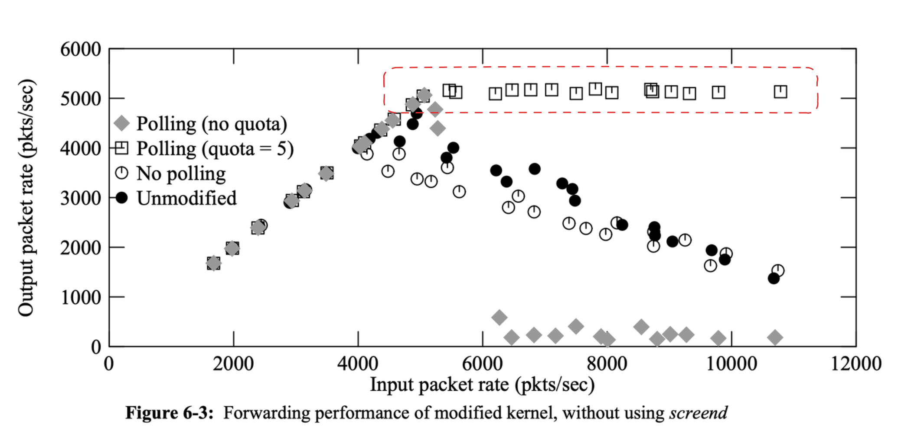

# Takeaways

* Why does receive livelock can occur in an interrupt-driven kernel when input load is **persistently** high: receive intterupt task has the highest priority
* How to avoid livelock: turnoff intterupt + polling
* OS setups some kernel threads that do not have user process context to process network packets
    * e.g. https://elixir.bootlin.com/linux/v6.19.11/source/kernel/softirq.c#L1156

# Motivations

Receive Livelock: the kernel spends all its time of processing (expensive) interrupt instead of doing useful work (e.g. processing packet).

* the machine only has single core

Network File System:

* applications use datagram protocol => no flow control => no negative feedback loop to control the source (e.g. reduce sending rate)

Router:

* NIC -> RX Interrupt Routine -> Input queue -> IP layer thread -> Output queue -> TX Interrupt Routine -> NIC

# Result

The modified interrupt-driven implementation elimate receive livelock without degrading other aspects of system performance.



---

# Details

## 4.2BSD Model

* Higher IPL(Interrupt Priority Level) tasks (e.g. hardware interrupt handler) preempt all lower IPL tasks (e.g. protocol processing)
* network device driver inital processing of the input packet: buffer management (places packet on a queue) and data link layer processing => generate software interrupt
    * If the queu is fulled, the packet is droped
* Attempt Batch intterupts => amortizes the cost of processing an interrupt over several packets
* The packet transmission priority is lower than the packet reception priority => the starvation of packet transmission is possible under high packet reception load (transittmer intterupt < receive intterupt: cant detect transmission completion)


## A system can behave in one of three ways as the offered input loada


Note: At loads above the MLFRR, the new incoming packets will be dropped when the (NIC/software) queue is fulled.

## Techniques to avoid livelock

* Turn off interrupt when software queue is fulled: no waste time on CPU spends time on dropping the received packet.
* Re-enable interrupt when software queue is "almost empty": prevent unncessary packet loss.
* Polling packets from different interfaces (e.g. one for RX, one for TX) in round-robin manner:
    * RR to ensure fairness and making progress on all interfaces

Polling thread pseudo code:

```
while(1)
  if NIC packets waiting
    read a packet from NIC
    completely process the packet
  else
    enable interrupts
    sleep
```

---

# Questions

Q. What is the meaning of using interface interrupts to schedule network tasks mentioned in abstract section?

In an interrupt-driven kernel, **EVERY** incoming packet triggers an interrupt.

The kernel just put the incoming packet into the queue instead of immediately process it.

section 4.1

Q. Why interrupt-driven systems tend to perform badly under overload?

Interrupt handler has highest priority, and high event rate causes constant switching from other tasks to interrupt handling.

Q. When can livelock happen?

It can happen when the rate of incoming events exceeds the CPU’s ability to handle them. In this situation:

* The CPU spends all its time responding to interrupts or retrying operations.
* Normal tasks are starved of execution time, even though the system is “busy.”

Q. What is the key idea or benefit of turning off interrupt when the input load is high?

The NIC can drop packets without wasting CPU time. CPU can use the time on processing packets on the queue.


---

# Why I read this paper

* I want to know why do interrupt-driven systems (use interface interrupts to schedule network tasks) degrade significantly at higher arrival rates?
* How to understand system overload behaviour
* Modern Linux uses a scheme -- NAPI -- inspired by this paper
    * https://www.usenix.org/legacy/publications/library/proceedings/als01/full_papers/jamal/jamal.pdf

# Futher Study

https://www.usenix.org/legacy/publications/library/proceedings/als01/full_papers/jamal/jamal.pdf
