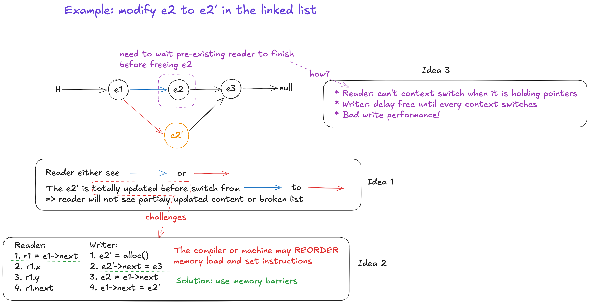

# Takeaways

* A way of concurrency control such that the reader does not have get lock while can access data safely

# Motivations

* Read-write lock is expensive even if no active writer
    * because the effect of cache invalidation (each core has its own cache) and atomic operation

# RCU Key Ideas



---

# Details

## A simplified version of the Linux RCU implementation

```c
// preempt_disable: 
// * a CPU local variable -> no shared CPUs state -> no contention, will not cause other CPUs cache miss/cache invalidation
// * a counter -> nesting is allowed
void rcu_read_lock()
{
    preempt_disable[cpu_id()]++;
}

void rcu_read_unlock()
{
    preempt_disable[cpu_id()]--;
}

void synchronize_rcu(void)
{
    // briefly executes on each cpu
    for_each_cpu(int cpu)
        run_on(cpu);
}
```

* The implementation is based on **scheduler context switch**. 
    *  RCU critical sections disable thread preemption => every CPU executes
       a context switch implies all pre-existing critication sections are complete
    * so synchronize_rcu only has to wait every CPU executes a context switch
* The scope of the lock is NOT **per object**.


## Using RCU

* Wait for completion: Linux NMI system
    * Figure 4
* Reference counting: Linux network stack
    * Figure 6

---

# Questions

Q. Figure 8 shows the performance of acquiring a read-write lock for reading. The read-write lock's implementation is similar to the one you implemented in the lab. Looking at your read_acuire implementation and the overhead shown in Figure 8 in the paper, what operation in your implementation becomes more expensive as more cores acquire the lock in parallel in read mode?

Q. What are the performance requirements that led to the development of RCU?

* support for concurrent readers, even during **updates**
    * Why? many concurrent reads and writes e.g. VFS(dentry) and networking
* low computation and storage overhead
    * Why low storage overhead? kernel must synchronize access to **millions** of kernel objects. 
    * Why low computation overhead? kernel accesses data structures frequently using extremely short code paths.
* deterministic completion time

Q. What are the data structures/situations that not suitable to use RCU?

Data structures:

* Double linked list: insert a element needs to change 2 pointers.
    * No atomical CPU instruction to change two pointers.

Situations:

* write heavy
* sleep within critical section

Q. What are the kernel data structures that are write heavy?

* Network TX ring
* Scheduler run queue


---

# Why I read this paper

* **RCU is everywhere in Linux**
    * https://elixir.bootlin.com/linux/v6.19.11/source/fs/dcache.c#L366
    * https://elixir.bootlin.com/linux/v6.19.11/source/drivers/net/ethernet/mellanox/mlxsw/core.c#L2971
    * Figures 1, 10, and 11
    * => Understanding RCU is now a prerequisite for understanding the Linux implementation and its performance

# Further Study

